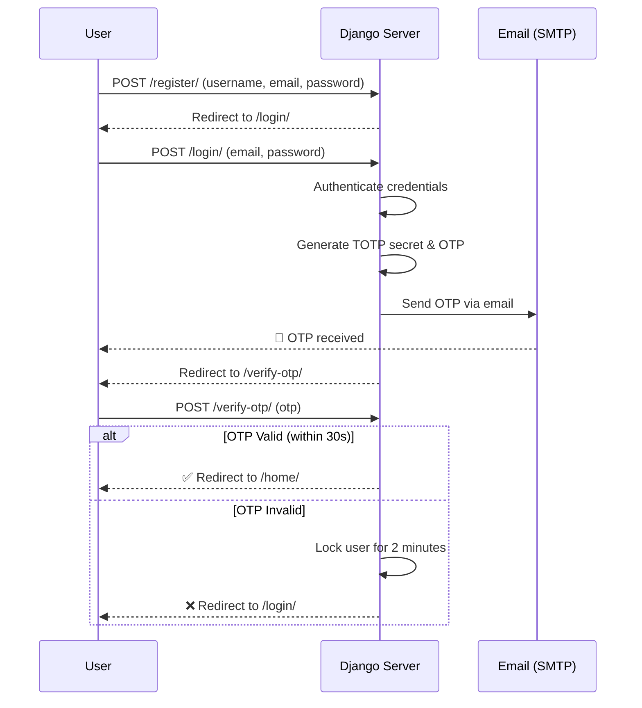
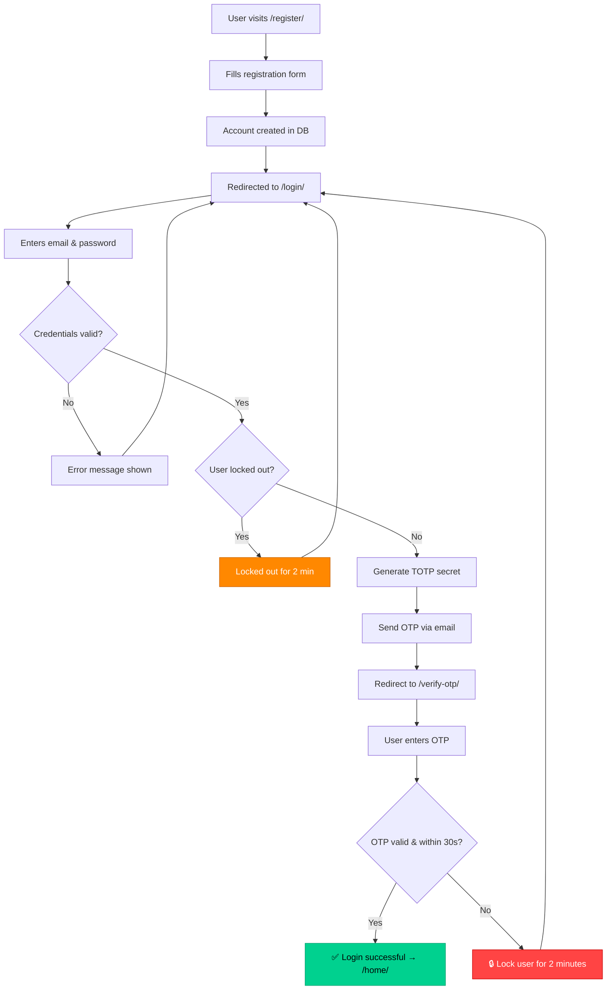

<div align="center">

# 🔐 Secondary Authentication Server (2FA)

A production-ready **Django-based Two-Factor Authentication** system that adds an extra layer of security to any application. Powered by **time-sensitive email OTPs** with built-in brute-force protection.

[](https://github.com/multiverseweb/2FA)


<a href="https://2fa.up.railway.app/"></a>

</div>

---

## 📋 Table of Contents

- [Overview](#-overview)
- [Key Features](#-key-features)
- [Tech Stack](#-tech-stack)
- [Architecture](#-architecture)
- [Snapshots](#-snapshots)
- [Getting Started](#-getting-started)
  - [Prerequisites](#prerequisites)
  - [Installation](#installation)
  - [Environment Variables](#environment-variables)
  - [Run Locally](#run-locally)
- [Deployment](#-deployment)
  - [Deploy to Railway](#deploy-to-railway)
  - [Deploy with Docker](#deploy-with-docker)
- [API Routes](#-api-routes)
- [Project Structure](#-project-structure)
- [How It Works](#-how-it-works)
- [Security Measures](#-security-measures)
- [Contributing](#-contributing)
- [License](#-license)

---

## 🌟 Overview

This project implements a robust **Two-Factor Authentication (2FA)** server using Django. When a user logs in with their credentials, the system generates a **time-based OTP** (One-Time Password) and delivers it to the user's registered email. The OTP is valid for only **30 seconds**, ensuring strong time-sensitive verification. If incorrect OTPs are entered, the system enforces a **2-minute lockout** to mitigate brute-force attacks.

> **Live Demo:** [https://2fa.up.railway.app/](https://2fa.up.railway.app/)

---

## ✨ Key Features

| Feature | Description |
|---|---|
| 🔑 **Email-Based OTP** | Sends a one-time password to the user's registered email upon login |
| ⏱️ **30-Second Expiry** | OTPs are time-sensitive and expire after 30 seconds using TOTP |
| 🚫 **Brute-Force Protection** | Locks out users for 2 minutes after incorrect OTP attempts |
| 👤 **Custom User Model** | Extends Django's `AbstractUser` for flexible user management |
| 📧 **SMTP Email Delivery** | Uses Gmail SMTP for reliable OTP delivery |
| 🐳 **Docker Ready** | Includes `Dockerfile` and `.dockerignore` for containerized deployment |
| 🚂 **Railway Deployment** | Pre-configured `Procfile` for one-click Railway deployment |
| 📱 **Responsive UI** | Mobile-friendly dark-themed interface with smooth animations |
| 🔒 **CSRF Protection** | Built-in Django CSRF middleware for form security |
| 🎨 **Animated Interface** | Fade-in animations and hover effects for a polished UX |

---

## 🛠️ Tech Stack


---

## 🏗️ Architecture



---

## 📸 Snapshots

| Account Registration |
|---|
|  |

<details>
<summary><b>🖼️ View More Screenshots</b></summary>

| Account Login |
|---|
|  |

| OTP Verification |
|---|
|  |

| Correct OTP Entered |
|---|
|  |

| Incorrect OTP (1st Attempt) | Incorrect OTP (2nd Attempt — Lockout) |
|---|---|
|  |  |

</details>

---

## 🚀 Getting Started

### Prerequisites

- **Python** 3.10+
- **pip** (Python package manager)
- **Git**
- A **Gmail account** with [App Passwords](https://myaccount.google.com/apppasswords) enabled (for SMTP)

### Installation

```bash
# Clone the repository
git clone https://github.com/multiverseweb/2FA.git
cd 2FA

# Create a virtual environment
python -m venv venv

# Activate it
# On Windows:
venv\Scripts\activate
# On macOS/Linux:
source venv/bin/activate

# Install dependencies
pip install -r requirements.txt
```

### Environment Variables

Create a `.env` file in the project root (or set these as system environment variables):

```env
# Email configuration (required for OTP delivery)
EMAIL_USER=your-email@gmail.com
EMAIL_PASS=your-gmail-app-password

# Django configuration (optional for local dev)
DJANGO_ALLOWED_HOSTS=127.0.0.1 localhost
SECRET_KEY=your-secret-key-here
DEBUG=True
```

> [!IMPORTANT]
> You must use a **Gmail App Password**, not your regular Gmail password. Generate one at [Google App Passwords](https://myaccount.google.com/apppasswords).

### Run Locally

```bash
# Apply database migrations
python manage.py migrate

# Start the development server
python manage.py runserver
```

Open your browser and navigate to **[http://127.0.0.1:8000/](http://127.0.0.1:8000/)**

---

## 🌐 Deployment

### Deploy to Railway

This project is pre-configured for **Railway** deployment:

1. **Fork** this repository
2. Go to [railway.app](https://railway.app/) and create a new project
3. Select **"Deploy from GitHub repo"** and connect your fork
4. Add the following **environment variables** in Railway's dashboard:

   | Variable | Value |
   |---|---|
   | `EMAIL_USER` | Your Gmail address |
   | `EMAIL_PASS` | Your Gmail App Password |
   | `DJANGO_ALLOWED_HOSTS` | `.up.railway.app` |
   | `CSRF_TRUSTED_ORIGINS` | `https://*.up.railway.app` |
   | `SECRET_KEY` | A strong random secret key |
   | `DEBUG` | `False` |

5. Railway will automatically detect the `Procfile` and deploy using **Gunicorn**

> [!TIP]
> Generate a secure `SECRET_KEY` with:
> ```bash
> python -c "from django.core.management.utils import get_random_secret_key; print(get_random_secret_key())"
> ```

### Deploy with Docker

```bash
# Build the Docker image
docker build -t 2fa-server .

# Run the container
docker run -p 8000:8000 \
  -e EMAIL_USER=your-email@gmail.com \
  -e EMAIL_PASS=your-app-password \
  -e DJANGO_ALLOWED_HOSTS="localhost 127.0.0.1" \
  -e SECRET_KEY=your-secret-key \
  2fa-server
```

---

## 🗺️ API Routes

| Method | Endpoint | Description | Auth Required |
|---|---|---|---|
| `GET/POST` | `/` | Redirects to `/register/` | ❌ |
| `GET/POST` | `/register/` | User registration page | ❌ |
| `GET/POST` | `/login/` | User login page (sends OTP on success) | ❌ |
| `GET/POST` | `/verify-otp/` | OTP verification page | ❌ (session-based) |
| `GET` | `/home/` | Authenticated home page | ✅ |
| `GET` | `/admin/` | Django admin panel | ✅ (staff) |

---

## 📁 Project Structure

```
2FA/
├── authapp/                    # Main authentication app
│   ├── templates/authapp/      # HTML templates
│   │   ├── home.html           # Post-login success page
│   │   ├── login.html          # Login form
│   │   ├── register.html       # Registration form
│   │   └── verify_otp.html     # OTP input form
│   ├── admin.py                # Admin site registration
│   ├── apps.py                 # App configuration
│   ├── forms.py                # Django forms (Register, Login, OTP)
│   ├── models.py               # CustomUser model (extends AbstractUser)
│   ├── urls.py                 # App URL routing
│   └── views.py                # View logic (register, login, OTP, home)
├── project_2FA/                # Django project configuration
│   ├── settings.py             # Project settings (DB, email, static files)
│   ├── urls.py                 # Root URL configuration
│   ├── wsgi.py                 # WSGI entry point
│   └── asgi.py                 # ASGI entry point
├── static/styles/
│   └── style.css               # Global stylesheet (dark theme)
├── images/                     # Screenshot assets for README
├── .dockerignore               # Docker ignore rules
├── .gitignore                  # Git ignore rules
├── Dockerfile                  # Docker container configuration
├── LICENSE                     # MIT License
├── Procfile                    # Railway/Heroku process file
├── manage.py                   # Django management script
├── requirements.txt            # Python dependencies
└── README.md                   # This file
```

---

## ⚙️ How It Works



---

## 🛡️ Security Measures

| Measure | Implementation |
|---|---|
| **Time-Based OTP** | Uses `pyotp` TOTP with a 30-second interval |
| **Brute-Force Lockout** | 2-minute lockout after incorrect OTP attempt |
| **CSRF Protection** | Django's built-in CSRF middleware on all forms |
| **Password Hashing** | Django's default PBKDF2 password hasher |
| **Session Management** | Server-side session for login state tracking |
| **Secure Email** | TLS-encrypted SMTP connection (port 587) |
| **Environment Secrets** | Email credentials stored in environment variables |

---

## 🤝 Contributing

Contributions are welcome! Here's how you can help:

1. **Fork** the repository
2. **Create** a feature branch
   ```bash
   git checkout -b feature/amazing-feature
   ```
3. **Commit** your changes
   ```bash
   git commit -m "Add amazing feature"
   ```
4. **Push** to the branch
   ```bash
   git push origin feature/amazing-feature
   ```
5. **Open** a Pull Request

> [!NOTE]
> Please make sure your code follows the existing style and includes appropriate documentation.

---

## 📄 License

This project is licensed under the **MIT License** — see the [LICENSE](LICENSE) file for details.

---

<div align="center">

**Made with ❤️ by [Tejas Gupta](https://github.com/multiverseweb)**

⭐ Star this repo if you found it useful!

</div>
